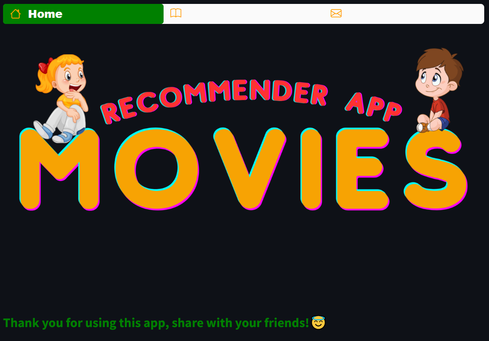
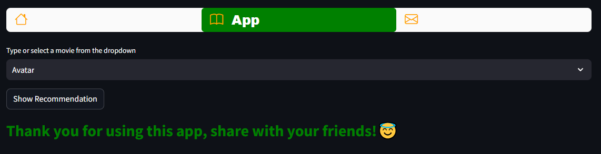
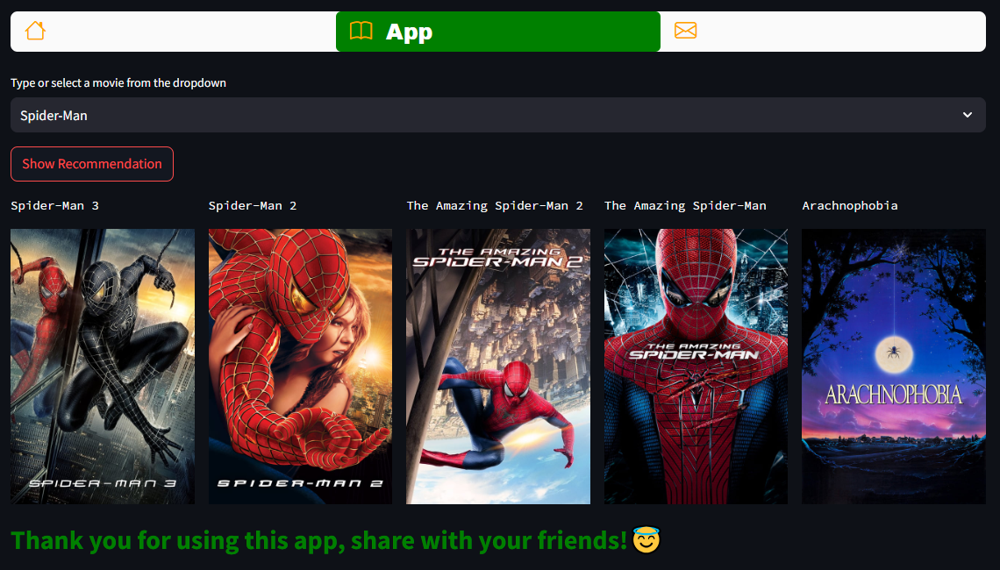
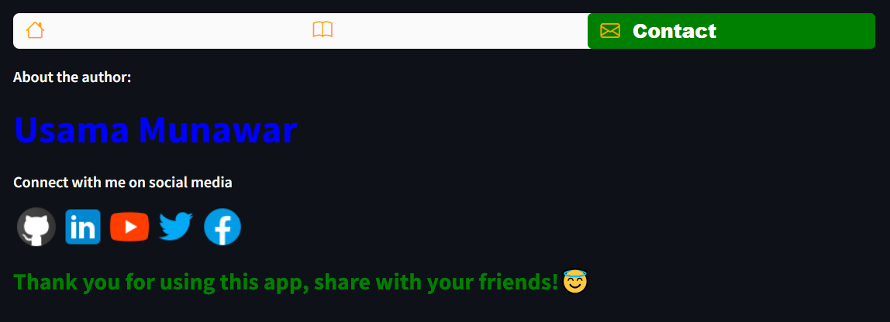

# 🎬 Movies Recommender Web-App

Welcome to the **Movies Recommender Web-App**! 🚀 This documentation provides a complete overview of a movie recommendation system designed to suggest movies based on your preferences. It leverages machine learning and movie data to provide personalized recommendations using a web application interface.

## Dataset Overview 🌟

The system uses two key datasets for movie information:

- **tmdb_5000_movies.csv**: Contains information about movies, including titles, release dates, and various other features.
- **tmdb_5000_credits.csv**: Includes the credits data for the movies, such as cast and crew information.

The main columns used from these datasets include:

- **movie_id**: Unique identifier for each movie.
- **title**: Title of the movie.
- **overview**: Short description of the movie.
- **genres**: Genres associated with the movie.
- **cast**: Leading actors and actresses.
- **crew**: Crew members involved in movie production (directors, writers, etc.).

## Data Preprocessing 🛠️

1. **Text Processing**: The movie descriptions (overviews) and other textual features are converted into numerical form using techniques such as TF-IDF (Term Frequency-Inverse Document Frequency). This helps the recommendation model understand similarities between movies based on text content.
   
2. **Similarity Calculation**: Cosine similarity is used to measure the distance between movie feature vectors. The system calculates which movies are most similar to the one the user selects.

## Machine Learning Model 🤖

The recommendation system is powered by a **content-based filtering algorithm**, which compares movies based on their features such as genre, description, and cast. The app finds movies that are similar to the one selected by the user and recommends them accordingly.

## App Features 🚀

### 1. Home 🏠
- The "Home" page displays a welcoming image and provides a brief introduction to the Movie Recommender App. This is the landing page for the web app.
  
### 2. App 🎥

- The **App** page is where you can use the movie recommendation system. Here's how it works:
  
- **Select a movie**: Use the dropdown menu to choose a movie title that you're interested in.
  
- **Click "Show Recommendation"**: After selecting a movie, click the button to get movie recommendations. The app will analyze your selected movie and recommend 5 similar movies.

- **Explore recommendations**: You'll receive a list of recommended movies, each accompanied by a movie poster and title. These recommendations are tailored to your selected movie and allow you to discover new movies based on your preferences.

### 3. Contact 📱

- On the **Contact** page, you can get to know the author of the app and connect on various social media platforms.
 
- **About the Author**: Learn more about the developer behind the app, Usama Munawar.
  
- **Social Media Links**: Follow Usama on GitHub, LinkedIn, YouTube, Twitter, and Facebook to stay updated on the latest projects and news.

## Author 👨‍💻

**Usama Munawar** 📝

Connect with me on social media:
- [GitHub](https://github.com/UsamaMunawarr) 🚀
- [LinkedIn](https://www.linkedin.com/in/abu--usama) 🌐
- [YouTube](https://www.youtube.com/@CodeBaseStats) 🎥
- [Twitter](https://twitter.com/Usama__Munawar) 🐦
- [Facebook](https://www.facebook.com/profile.php?id=100005320726463) 👍

## License 📜

This project is licensed under the MIT License. Feel free to explore, modify, and share this project under the terms of the license. 📄
